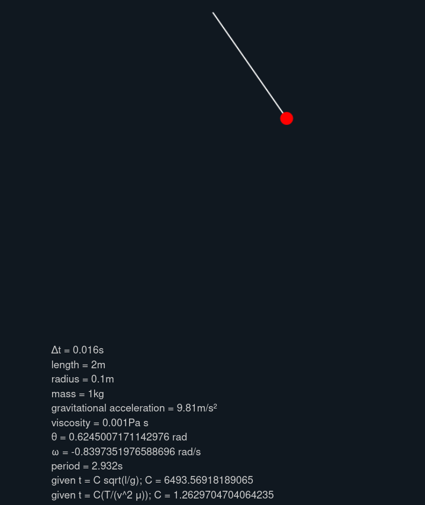

# Simple Pendulum Simulation

A quick-and-dirty pendulum simulation to test the reasonableness of two models derived via dimentional analysis, made in my APPM class.

To run the simulation, simply load index.html in your browser.

(You'll probably need to download the files to your machine first? I doubt that simply viewing the raw file on github or sourcehut will actually work, but you may try it if you want!)

## License

I have set this free into the public domains under the terms of the [Unlicense](https://unlicense.org).

Do whatever you want with it. I don't care.

I only spent like an hour on this anyways.
